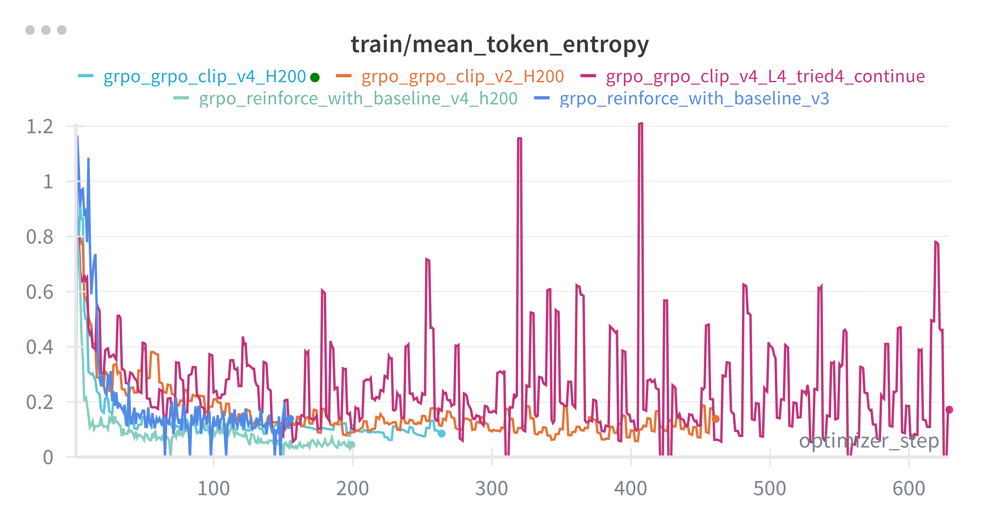
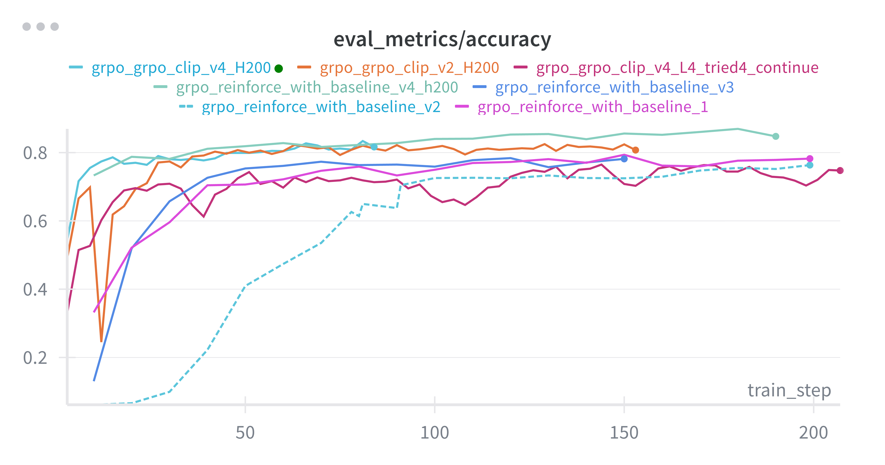

# GSM8K 数学推理强化学习系统（Qwen2.5-Math-1.5B）

本仓库实现了一个用于数学推理任务的强化学习训练与评估系统，目标是验证小参数推理模型 **Qwen2.5-Math-1.5B** 是否可以仅依靠可验证奖励（verified reward），在不依赖闭源 Reward Model、不依赖教师大模型蒸馏的情况下，显著提升数学推理正确率与推理链质量。

在严格的 0-shot 评测设定下（输出格式和最终数值必须同时正确），该系统将同一 base model 的 pass@1 accuracy 从约 **5.4%** 提升到约 **83% ~ 87%**，显著超过更大规模的开源推理模型（例如 Llama-3.1-8B-Instruct 约 41%，Qwen3-8B thinking 模式约 15%，deepseek-math-7b-rl 约 1.1%）。

> 说明：本项目最初以 Stanford CS336 Assignment 5 为起点，仅复用了基础测试脚本与若干启动流程。核心强化学习管线、策略优化逻辑、优势函数设计、显存适配、断点恢复、监控与可复现性均为独立实现。


---

## 0. 总览

系统由 `cs336_alignment/grpo_with_checkpoint.py` 统一调度，包含以下核心部分：

- **推理 Prompt 约束**（格式即行为规范）
- **批量 rollout 生成**（vLLM）
- **自动化奖励计算**（verified reward）
- **策略梯度优化**（REINFORCE+baseline，Dr GRPO）
- **训练稳定性控制与显存适配**
- **断点恢复与可复现实验**
- **严格评测与基线对比**

下面按这一顺序展开说明。

---

## 1. 推理 Prompt 规范

训练和评估时，模型必须用统一的回答格式作答。系统使用的对话式 prompt 模板为：

```text
A conversation between User and Assistant. The User asks a question, and the Assistant solves it. The Assistant first thinks about the reasoning process in the mind and then provides the User with the answer. The reasoning process is enclosed within <think> </think> and answer is enclosed within <answer>\boxed{}</answer> tags, respectively, i.e., <think> reasoning process here </think> <answer> answer here </answer>. Only pure answer should be placed inside <answer></answer>. For example, <answer>Tim has 3 apples</answer> is wrong, <answer>\boxed{3}</answer> is correct for the case where ground truth is 3.

User: {question}
Assistant:
```

要求：

* 推理过程（Chain-of-Thought）必须出现在 `<think> ... </think>` 内。
* 最终答案必须出现在 `<answer> ... </answer>` 内，且是一个 `\boxed{...}` 的数学量（纯数值或可化简到等价数学表达式）。
* 不能输出多个候选答案，不能用自然语言规定答案区域。

训练和评估都强制走这套格式。该约束本身就是一部分训练信号：如果输出不符合格式，即使数值正确也不会给正向奖励。

这种“格式即合规、数值即正确”的标准，比常见的宽松评测（如允许自由文本回答、少量格式噪声）更严格。这也解释了为什么 base model（Qwen2.5-Math-1.5B）在我们定义的严格 0-shot pass@1 accuracy 下只有约 5.4%，而不是公开报告的 few-shot/成绩。

---

## 2. 强化学习训练流程（RLVR Pipeline）

整个强化学习流程是一个闭环，核心步骤如下：

### 2.1 构造训练样本与 rollout

* 通过 `get_gsm8k_train_ready_prompts()` 读取并整理 GSM8K 的题目和标准答案，构造成 0-shot prompt/answer 对。
* 使用 `vLLM` 以批为单位进行并行推理采样。一个 batch 内，同一题目会生成多条候选回答（例如 `group_size = 8`），得到多条 `<think> ... </think> <answer> ... </answer>` 风格的完整推理轨迹。
* `SamplingParams` 控制温度、max tokens、stop tokens、随机种子等，确保组内采样可比较。

> vLLM 初始化时会显式配置（如禁用 FlashInfer、指定 FlashAttention 策略、multiprocessing 策略等），以保证不同 GPU 上行为一致。

### 2.2 自动奖励（Verified Reward）

* 对每条候选回答，使用 `drgrpo_grader.r1_zero_reward_fn` 计算奖励。

* 该函数会：

  1. 检查输出格式是否严格符合 `<think>...</think> <answer>\boxed{...}</answer>`；
  2. 提取 `\boxed{...}` 内的最终答案；
  3. 将答案与标准答案比对，使用符号等价、数值等价、代数化简等一系列检查（基于 [sail-sg/understand-r1-zero](https://github.com/sail-sg/understand-r1-zero) 中的 `math_grader.py`），返回 `reward ∈ {0.0, 1.0}`。

* 奖励定义非常简单直接：

  * 格式合规且答案正确 → `reward = 1.0`
  * 否则 → `reward = 0.0`

* 没有人工标注，没有额外 Reward Model，没有 teacher logits distillation。奖励只有一位信息（对/错），但它足够稳定且可以完全自动评估。

### 2.3 优势函数（Advantage）计算

* 对同一题目的多条回答形成一个“组”（group）。

* 组内计算 $baseline：b = mean(reward_i)$ ，即该组平均奖励。

* 每条样本获得优势值：
  
 $$
  A_i = reward_i - b
 $$

* 和常见 RLHF 里的做法不同：

  * 我们不做标准差归一化（不除以组内标准差）。标准差归一化在小 batch 里会放大极端样本，导致训练在少数极难问题上过拟合，不稳定。
  * 每条样本等权处理，不按 token 数量或推理解长度再加权，避免“长解释 = 大梯度”这种偏置。

* 这些优势值会被记录到 wandb（例如 `raw_reward/mean`, `advantage/mean`, `advantage/max`），用于实时观察奖励分布。

### 2.4 策略更新

* 采样得到的回答（从旧策略产生）会被再次送入当前策略，计算 token-level log prob，进而计算 loss 并反向传播更新策略。
* 为了控制显存：

  * 使用 `bitsandbytes` 的 `PagedAdamW8bit` 优化器。
  * 使用 `bfloat16`。
  * 使用梯度累积（例如 `gradient_accumulation_steps = 32`）以在单卡 24GB 显存上模拟较大的有效 batch size（例如等效 `train_batch_size = 64`）。
* 训练循环中，若某一 micro batch 的优势几乎为 0，则这批可以跳过更新，避免噪声主导梯度。

### 2.5 调度与评估

* 每完成一个 `train_step`，系统会：

  * 记录 token-level log prob / entropy 分布。
  * 记录 `raw_reward/*`, `advantage/*`, `loss`, 学习率等训练状态到 wandb。
* 每隔固定步数（例如每 3 步）调用 `grpo_evaluate.evaluate`，对 GSM8K test split 做全量 0-shot 评测，得到 pass@1 accuracy。
* 定期（例如每 30 步）保存 checkpoint（模型、优化器、scheduler、随机数状态、wandb offset 等），并允许从指定的 `start_train_step` 直接恢复继续训练。

> 整个训练-评估-日志管线由 `cs336_alignment/grpo_with_checkpoint.py` 统一驱动。

---

## 3. 策略梯度目标：REINFORCE+baseline 与 GRPO / Dr GRPO

系统实现并比较了三类更新规则：
* 经典 REINFORCE+baseline（无 ratio clipping），
* 原始 GRPO 公式，
* Dr GRPO（我们最终采用的变体）。

这三者都使用同一个奖励定义（0/1 verified reward），区别在于梯度如何约束、是否对样本再加额外缩放。

### 3.1 REINFORCE + baseline

对第 (i) 条样本，记：

* $reward_i$：$r1_zero_reward_fn$ 给出的 0/1 奖励
* $b$：该题目组的平均奖励
* $A_i = reward_i - b$

定义目标（最小化的 loss）为经典 REINFORCE 形式：

$$
L_{\mathrm{REINFORCE}}(\theta) = - \mathbb{E}_{i}\left[ A_i \log \pi_{\theta}(i) \right]
$$

解释：

* 如果该回答比组内平均水平更好（一般就是“答对的那条”），则 (A_i > 0)，优化会提升它的概率。
* 如果它比平均水平差（一般是“答错的那些”），则 (A_i < 0)，优化会压低它的概率。
* baseline (b) 可以有效降低方差，不需要训练单独的 value head。

本实现与常见 RLHF 略有不同点：

* 不做 advantage 的标准差归一化。
* 不按 token 长度加权。
* 不引入 KL penalty 或 entropy bonus 去约束策略分布漂移，而是靠 batch 内对比和学习率控制保持稳定。

在实践中，这个变体在大约 200 个 on-policy update step 后，可以把严格 0-shot pass@1 accuracy 提升到约 **87%**。

### 3.2 原版 GRPO 公式

公开的 GRPO（Group Relative Policy Optimization）可以看作是把 PPO-Clip 的思想用在“同一题目的多条候选回答”上。设同一题目的第 i 条完整回答为 o_i，其第 t 个 token 为 o_{i,t}，问题是 q。把同一题采样到的所有回答写成 {o_1, ..., o_G}。对该题定义组大小为 G。

GRPO 的目标（写成要最小化的 loss 的负号形式）可以表示为：

$$
\mathcal{L}_{\mathrm{GRPO\text{-}Clip}}(\theta)
= - \frac{1}{G} \sum_{i=1}^{G} \frac{1}{|o_i|} \sum_{t=1}^{|o_i|}
\min\\bigl(
  r_{i,t}(\theta)\,\hat{A}_{i,t},\;
  \mathrm{clip}\bigl(r_{i,t}(\theta),\,1-\varepsilon,\,1+\varepsilon\bigr)\,\hat{A}_{i,t}
\bigr)
$$

其中:

$$
r_{i,t}(\theta)
= \frac{\pi_{\theta}\bigl(o_{i,t}\mid q,\,o_{i,\lt t}\bigr)}
       {\pi_{\theta_{\mathrm{old}}}\bigl(o_{i,t}\mid q,\,o_{i,\lt t}\bigr)}
$$

$$
\hat{A}_{i,t}
= \frac{
  R(q, o_i) - \mathrm{mean}\!\bigl(\{ R(q, o_1), \ldots, R(q, o_G) \}\bigr)
}{
  \mathrm{std}\!\bigl(\{ R(q, o_1), \ldots, R(q, o_G) \}\bigr)
}
$$

两个重要特性：

* Token-length weighting
外层有一个 $\frac{1}{|o_i|}$ 。也就是说，回答越长，单个 token 的梯度越被平均，等价于“把一条长回答的总权重分摊到它的所有 token 上”。这会让长回答在整体上被“均摊”，而短回答在整体上被“放大”。

* Std normalization
$\hat{A}_{i,t}$ 使用了组内奖励的标准差 std(...) 进行归一化。也就是把 (reward_i - 平均奖励) 除以组内标准差。直观上，这是在做一个“z-score 标准化”，目的是放大当前 batch 里相对更好的回答并抑制方差。

### 3.3 Dr GRPO（GRPO 变种）

Dr GRPO 的思想与 GRPO 类似：使用比值裁剪（ratio clipping）控制单步更新幅度，接近 PPO/PPO-Clip 风格的稳定性约束。
Dr GRPO 移除了上面两个会放大偏置的因素，得到的公式是：

记：

* `old_log_prob_i`：rollout 时旧策略对第 (i) 条回答的 log prob

* `new_log_prob_i`：当前策略对同一回答重算得到的 log prob

* 概率比：

$$
  r_i = \exp(\log \pi_\theta(i) - \log \pi_{\text{old}}(i))
  ]
$$

* 同样我们有 ($A_i = reward_i - b$)，与 REINFORCE 一致，不做 std-normalization。

Dr GRPO 的目标函数（最小化的 loss）采用裁剪后的 surrogate：

$$
L(\theta)
= \frac{1}{G} \sum_{i=1}^{G} \sum_{t=1}^{|o_i|}
\min\bigl(
  \frac{\pi_{\theta}(o_{i,t} \mid q,\, o_{i,\lt t})}{\pi_{\theta_{\mathrm{old}}}(o_{i,t} \mid q,\, o_{i,\lt t})} \,\hat{A}_{i,t},
  \mathrm{clip}\bigl(
    \frac{\pi_{\theta}(o_{i,t} \mid q,\, o_{i,\lt t})}{\pi_{\theta_{\mathrm{old}}}(o_{i,t} \mid q,\, o_{i,\lt t})},
    1-\varepsilon,\,
    1+\varepsilon
  \bigr)\,\hat{A}_{i,t}
\bigr)
$$

其中:

$$
\hat{A}_{i,t}
= R(q, o_i) - \mathrm{mean}\bigl( R(q, o_1), \ldots, R(q, o_G) \bigr)
$$


其中 $\epsilon$ 是一个可以调节的的 clip range（本实验中最后选择为 `0.30`）。
直观理解：

* 当新策略试图“过度推高”某条回答的概率时（即 (r_i) 偏离 1 太多），clip 会限制更新力度，避免单步过拟合。

区别与 GRPO 非常明确：

* 我们不再用 $\frac{1}{|o_i|}$ 去缩放一条回答内部所有 token 的权重。一定程度上抑制了回答变长的趋势。

不再除以组内标准差 std
$\hat{A}_{i,t}$ 只是简单的 reward_i - mean_reward，而不是 z-score。这样可以避免在小 batch 下由于标准差太小而把极少数高分回答的权重放大到不稳定的程度，也避免 reward=0/1 这种离散信号被“硬性拉伸”。

训练细节：

* 我们会对同一批 rollout 轨迹进行多轮更新（例如 `epoch_per_rollout_batch = 3`）。
* 第一轮使用未裁剪项，后续轮在相同样本上继续更新但加入 ratio clipping，以在不增加新样本的情况下稳步吸收该批次的信号。

实验结果：

* Dr GRPO 在同等训练步数下可收敛到约 **83%** pass@1 accuracy。
* 虽然略低于 REINFORCE+baseline (~87%)，但在扩大 batch（例如从 ~1.6k 样本到 ~6.4k 样本）和迁移到高算力 GPU（H200）时，Dr GRPO 的训练更平滑、更可控。
* 我们在此过程中同样没有额外 KL penalty、没有 entropy bonus，稳定性完全来自 clip 和适度学习率。


### 3.4 消融实验：为什么我们最终采用 Dr GRPO

我们针对 GRPO 系列做了 4 组消融，分别关闭不同的缩放项，观察稳定性和最终准确率：

* 原版 GRPO
同时保留 token-length weighting $\frac{1}{|o_i|}$ 和 std normalization (/ std(...))。

* GRPO 去掉 std normalization
保留 token-length weighting，但把 $\hat{A}_{i,t}$ 改成 reward_i - mean_reward，即不再除以组内标准差。

* GRPO 去掉 token-length weighting
去掉外层的 $\frac{1}{|o_i|}$ ，但仍使用 z-score 风格的 (reward_i - mean_reward) / std(...)。

* Dr GRPO（两者都去掉）
既不对长回答做 $\frac{1}{|o_i|}$ 的均摊，也不做标准差归一化。也就是 3.3 节给出的公式。

最终我们选用了Dr GRPO进行进一步的实验，Dr GRPO在回答长度抑制方面表现更优秀，以及训练会更稳，batch 间不会因为极少数高分回答而出现巨大梯度尖峰，能更好的利用奖励信息。

结合 3.1 节的 REINFORCE+baseline（无 clip，单次更新幅度更大），我们最终保留了两条训练路径：

* REINFORCE+baseline：在较小算力、较小 batch 下可以最快把准确率推高到 ~87%。

* Dr GRPO：在较大算力和大吞吐 rollout 下仍保持稳定，达到 ~83%，并且更容易规模化。

### 3.5 对比总结

* 两种方法使用的是同一 reward 定义，reward 完全可自动判定。
* REINFORCE+baseline 在 200 步内冲到最高准确率（~87%）。
* Dr GRPO 提供一个更接近工业 PPO/GRPO 范式的更新流程，在更大 rollout/更高吞吐时仍保持训练稳定，达到 ~83%。

这说明在一个 1.5B 参数量级的数学推理模型上，纯粹依靠 verified reward + 策略梯度（无RM、无teacher）就能显著提升推理能力。

---

## 4. 资源效率与扩展性

该系统专门针对“低计算资源但仍然想尝试RL”的现实情况进行优化，同时也支持迁移到高带宽 GPU。

* **单卡 L4 (24GB)**

  * 主体开发、调参、稳定性验证均在单卡 NVIDIA L4 (24GB) 上完成，总训练时间超过 200 GPU 小时。
  * 使用 `bfloat16`、`8-bit Adam (PagedAdamW8bit)`、梯度累积、rollout 阶段与反向更新阶段解耦等手段，使 24GB 显存在 RL 训练中仍可稳定运行。
  * 训练过程全程接入 `wandb` 监控，包括奖励分布、优势分布、token-level entropy、loss 曲线、学习率调度等指标。

* **H200 扩展**

  * 同一套代码和训练逻辑可直接迁移到 NVIDIA H200 上运行，单轮 rollout 规模可从约 1.6k 样本扩展到约 6.4k 样本（约 50 GPU 小时）。
  * 扩大 rollout 后仍保持相同数量级的 update step 和相近的收敛水平，说明该方法可以在高算力环境下线性放大吞吐，而不需要重新设计算法。

* **超参适配**

  * 通过调节如 `gpu_memory_utilization`、`sampling_max_tokens`、`rollout_batch_size` 等参数，可以适配不同显存容量。
  * 典型设置：`gpu_memory_utilization = 0.80`，`sampling_max_tokens = 512`，`gradient_accumulation_steps = 32`，`epoch_per_rollout_batch = 3`。

---

## 5. 实验结果（GSM8K test split, 严格 0-shot）

| 训练策略 / 模型                    | pass@1 Accuracy | 训练步骤                | 说明                               |
| ---------------------------- | --------------- | ------------------- | -------------------------------- |
| Qwen2.5-Math-1.5B (原始)       | ~5.4%           | -                   | 严格 0-shot 基线                     |
| REINFORCE+baseline (本系统)     | ~87%            | ~200 on-policy step | 无 KL/entropy 正则，仅靠组内 baseline 优势 |
| Dr GRPO / clipped GRPO (本系统) | ~83%            | ~200 step           | ratio clipping (clip≈0.30)，更稳但略低 |
| Llama-3.1-8B-Instruct        | ~41.3%          | -                   | 同一评测脚本下                          |
| Qwen3-8B (thinking 模式)       | ~14.9%          | -                   | 同一评测脚本下                          |

说明：

* 所有对比模型都在“同一评测脚本、同一严格标准”下评测。
* 评测标准要求格式正确且数值正确，否则计为错误；并不接受“自然语言口头答案”或“接近正确”的输出。
* 因此上述准确率可以直接作为同等条件下的强基准对比。

---

## 6. 训练监控与可视化

训练中所有关键指标都会自动上传到 Weights & Biases (wandb)，包括但不限于：

* `raw_reward/*`：每个 batch 的平均 reward、最大 reward 等；
* `advantage/*`：组内优势分布、边际样本对比；
* `token/*`：token-level log prob、token-level entropy（用于观察模式坍缩或过度自信）；
* `eval_metrics/*`：定期对 GSM8K test split 的 pass@1 accuracy；
* `optimizer/*`：学习率、梯度范数等。

下面为Token entropy随优化步的变化以及GSM8k Test集的随训练步变化的表现：


*图 1：token-level entropy 随训练步数的变化，用于监控模型是否在过早坍缩为“固定模版式回答”。*


*图 2：评测准确率随训练步数的变化，可见在约 200 步内快速上升并趋于稳定。*

---

## 7. 断点恢复与可复现实验

脚本 `cs336_alignment/grpo_with_checkpoint.py` 提供完整的断点恢复能力，支持长时间训练和跨 GPU 迁移。

* `save_checkpoint()` 会同时保存：

  * 模型权重
  * 优化器状态
  * 学习率调度器状态
  * 随机数生成器状态（`random` / `numpy` / `torch` / `torch.cuda`）
  * 当前全局 step 计数
  * wandb 运行偏移量

* 通过 `Load_From_Checkpoint=True` 并指定 `checkpoint_dir` 和 `start_train_step`，训练可以在另一块 GPU 上继续，无需重新 warm-up。

* 我们显式固定/恢复随机种子，禁用 CUDNN 的非确定性优化路径，以便不同训练会话间可以复现实验过程和评估结果。

---

## 8. 复现实验步骤

1. 安装依赖环境

   ```bash
   uv sync
   ```

2. 准备模型权重

   * 预先将 `Qwen/Qwen2.5-Math-1.5B` 下载至本地缓存。
   * 运行时可设置 `HF_HUB_OFFLINE=1`，避免训练中断于网络依赖。

3. 启动训练

   ```bash
   uv run python cs336_alignment/grpo_with_checkpoint.py
   ```

4. 观察训练

   * 通过 wandb 实时观察 reward、advantage、token entropy、eval accuracy 曲线。
   * 若显存不足，可在脚本中调低 `rollout_batch_size`、`sampling_max_tokens`，或提高 `gradient_accumulation_steps`。

5. 评估

   * 评估日志写入 `./outputs/`。
   * 终端会打印 GSM8K test split 上的 pass@1 accuracy，便于和上表 baseline 对比。

> 提示：训练中会周期性自动保存 checkpoint，在训练中断后可无缝恢复。

---

## 9. 代码结构

```text
.
├── cs336_alignment/
│   ├── grpo_with_checkpoint.py   # 强化学习主脚本（rollout / 训练 / 评估 / checkpoint恢复）
│   ├── grpo_utility.py           # 策略更新、优势函数计算、log prob/entropy提取等核心辅助函数
│   └── ...                       # 训练超参与调度逻辑
├── drgrpo_grader/                # verified reward 计算与格式校验（基于 math_grader 的变体）
├── outputs/                      # 评估日志、指标快照
├── grpo_checkpoint/              # checkpoint（模型权重、优化器状态、RNG状态等）
└── figure/                       # 训练曲线可视化示意图 (token entropy / eval accuracy)
```

* `grpo_with_checkpoint.py`：统一调度 rollout → 打分 → 计算优势 → 策略更新 → 定期评估 → 存 checkpoint。
* `grpo_utility.py`：核心 RL 逻辑，包括 REINFORCE+baseline、Dr GRPO 的 loss 计算，ratio clipping，log prob 与 entropy 的提取，梯度累积控制等。
* `drgrpo_grader/`：包含 `r1_zero_reward_fn` 及相关的数学答案解析/校验逻辑（源自 `sail-sg/understand-r1-zero` 的 `math_grader.py`，并针对本项目的输出格式约束做了适配）。
* `outputs/`：训练和评估结果（包括 pass@1 accuracy）。
* `grpo_checkpoint/`：可移植的中断恢复点。

---

## 10. 后续方向

* **奖励信号更细化**
  目前 reward 是二元的（正确=1 / 错误=0）。后续可以将 reward 拆分为“格式正确奖励 + 数值正确奖励 + 步骤一致性奖励”，在不妥协自动评估的前提下增加信号密度。

* **自适应训练策略**
  使用 token-level entropy 和 eval accuracy 曲线动态调节学习率、clip range、group_size 等超参，使训练在不同阶段自动平衡探索与收敛。

* **跨数据集泛化**
  将相同策略直接迁移到更难的推理基准（AIME24、MATH500 等）测试分布外性能，验证该 RLVR 管线是否能在更高难度数学场景下保持收益。

* **多 GPU / 更大批次 rollout**
  扩展 vLLM rollout 到多 GPU 并行，结合梯度检查点（activation checkpointing）与流水线式采样-更新，使吞吐和样本效率进一步提升。

---
